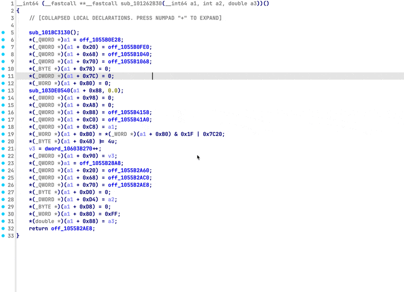
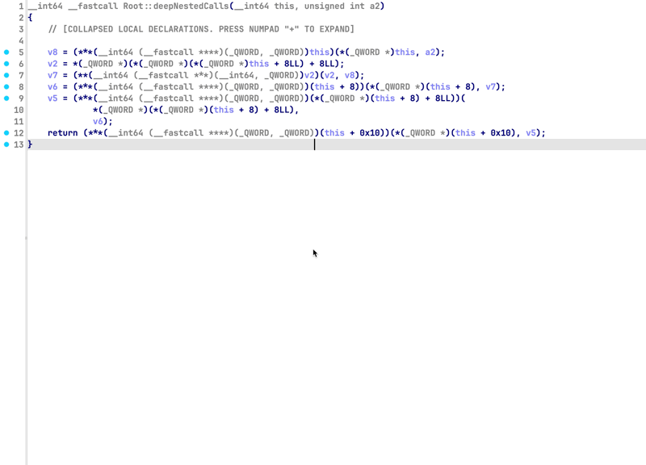
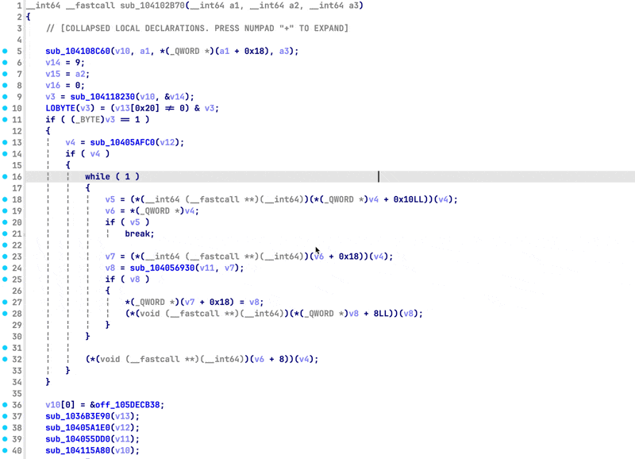
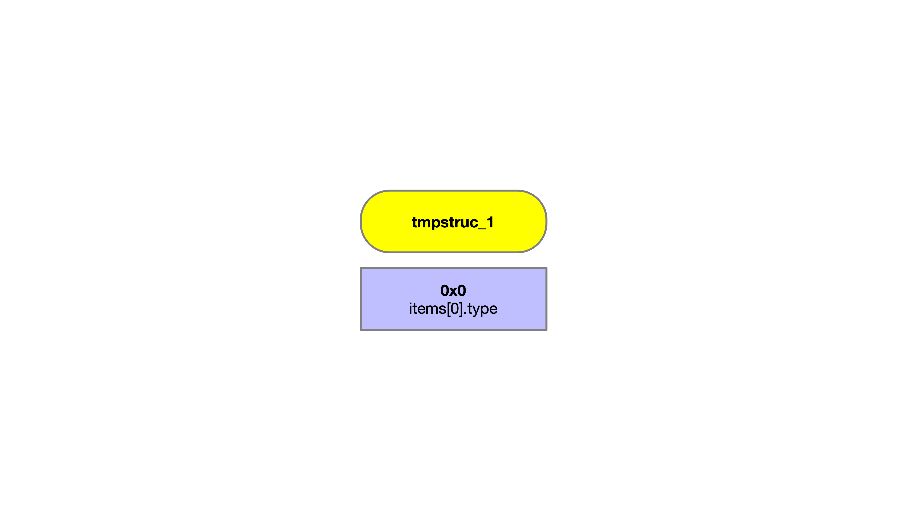
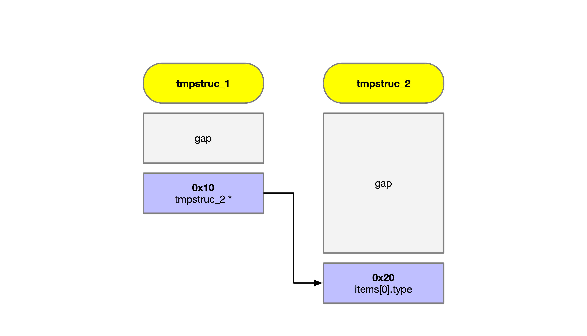
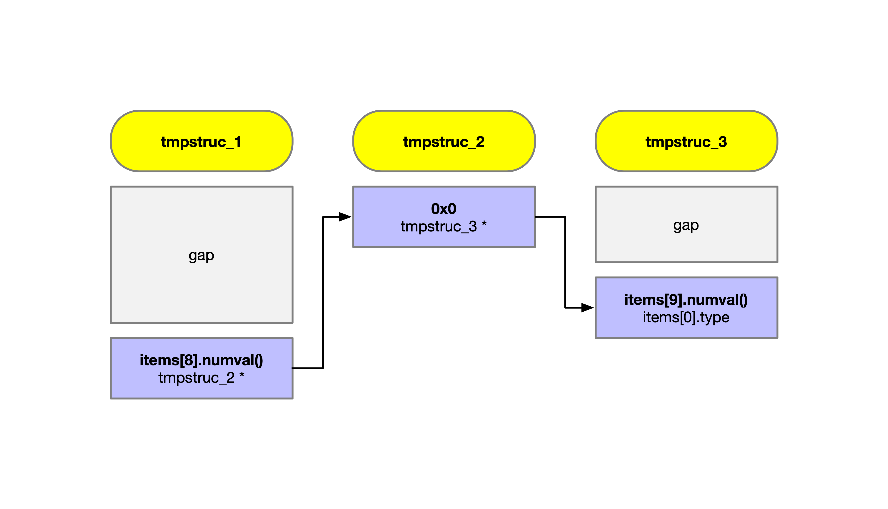

# Suture

Declarative AST pattern matching framework for Hex-Rays Decompiler with automated structure recovery.

## Preview

> mass member assignment with type inference and safe updates


> multi-level structure recovery

## Overview

**Suture** is a declarative AST pattern matching framework for Hex-Rays Decompiler that enables automatic structure reconstruction through pattern-based code analysis. Rather than manual member definition, Suture identifies memory access patterns across your decompiled code and reconstructs complete structure definitions automatically, including multi-level nested structures.

## Why Pattern Matching?

Traditional structure recovery requires writing complex procedural logic to handle all possible AST node combinations, which becomes difficult to maintain, debug, and extend. Suture's pattern-based approach makes it straightforward to define what you're looking for, and its built-in rule prioritization and matching complexity mean you don’t have to worry about the order in which rules are applied.

```python
ParsePattern("""
    i.op is idaapi.cot_ptr and
    i.x.op is idaapi.cot_cast and
    i.x.x.op is idaapi.cot_add and
    i.x.x.x.op is idaapi.cot_var and
    i.x.x.y.op is idaapi.cot_num
    """)
```

This declarative style is readable, maintainable, and makes it immediately clear what pattern you're matching. More importantly, extraction logic becomes trivial - once a pattern matches, the data you need is always at predictable positions in the matched items list, eliminating conditional branching and complex state tracking.

> [!Note]
> The built-in rules are designed to work with target variable typed as `__int64`. The current implementation temporarily assigns this type before pattern matching, then restores the inferred structure type. However, the pattern matching framework itself is completely generic - you can create rules to match any AST pattern regardless of variable types or context.

## Key Features

* **AST Pattern Matching**: Analyzes the abstract syntax tree of decompiled functions to identify structure access patterns.
* **Wildcard Support**: Use `cot_any` as a wildcard to match any operation type, allowing for flexible patterns.
* **Pattern Termination**: Use `cot_none` to explicitly terminate a pattern branch, asserting that no nodes follow.
* **Function Call Matching**: Match specific arguments in `cot_call` nodes using the `a=` parameter. Passing `Slice()` to `a=` will automatically expand the rule into concrete rules `a={i: Slice(...)}` based on `RuleSet.ArgumentLimit`.
* **Target Filtering**: The `Populator` automatically filters the results of a match, ensuring only items that directly reference the targeted variable are passed to the `extract()` method. This guarantees you are only processing and refining the specific variable you are currently targeting.
* **Predicate Functions**: Attach custom predicates to patterns for additional validation logic (e.g., `predicate=lambda e: ...`).

> [!Note]
> Wildcard argument expansion via `a=Slice(...)` is supported only when `cot_call` is the root of the pattern. When `cot_call` appears in a nested position, arguments must be matched explicitly using an index map (for example, `a={0: Slice(...)}`).

> [!Note]
> The predicate is evaluated against the specific node matched by the current **Slice**. While it is not automatically applied to children, the predicate receives the raw `cexpr_t` node, allowing you to manually traverse and inspect the entire subtree (including child nodes) if needed.

## Rule Prioritization

* Rules execute based on **weight** (higher weight = higher priority).
* When weights are equal, rules with higher **complexity** run first.
* Complexity is calculated based on depth, presence of predicates and operator specificity.

## The Items Match Order

When a `Rule` matches an AST pattern, the `extract(items)` method receives a list of all nodes that satisfied a `Slice`. The order is strictly determined by a **depth-first traversal** of your pattern tree (visiting `base`, then `x`, then `y`, then `z`, and finally `a`).

### Visualizing the sequence

Consider a pattern designed to find a call where the argument is a pointer calculation:

```python
return Slice(cot_call,                              # items[0]
             x=cot_obj,                             # items[1]
             a=Slice(cot_ptr,                       # items[2]
                     x=Slice(cot_cast,              # items[3]
                             x=Slice(cot_add,       # items[4]
                                     x=cot_var,     # items[5]
                                     y=cot_num      # items[6]
                                    )
                            )
                    )
            )

```

### Index mapping table

| Index      | AST Node Type | Role in Pattern                                          |
| ---------- | ------------- | -------------------------------------------------------- |
| `items[0]` | `cot_call`    | The call expression itself.                              |
| `items[1]` | `cot_obj`     | The function being called (the `x` branch of the call).  |
| `items[2]` | `cot_ptr`     | The argument node (matched via the expanded `a` branch). |
| `items[3]` | `cot_cast`    | The pointer cast inside the argument.                    |
| `items[4]` | `cot_add`     | The addition inside the cast.                            |
| `items[5]` | `cot_var`     | The base variable (e.g. `this` or a vtable pointer).     |
| `items[6]` | `cot_num`     | The numeric constant (e.g. the vtable offset).           |

### Implementation constraints

* **Concrete expansion**: Suture automatically expands `a=Slice()` into 8 (default) unique rule instances. This ensures `items[2]` is always **exactly one** specific argument of the call, never a list of arguments.
* **Predictable shifts**: If you omit a branch (e.g., you do not define `x=...`), the subsequent items shift up in the index list.

### AST Head Control

* **Elevated rules**: If `elevated` is True, the rule ignores the exclusivity list and can match nodes already claimed by other rules.
* **Exclusive rules**: If True, adds the matched **sub-nodes** (the components of the match) to the excluded list. This prevents other rules from re-processing the specific branches claimed by this pattern.
* **Smart Call Exclusivity**: When using `a=Slice()` as a wildcard to match any argument, Suture expands it into concrete rules based on `RuleSet.ArgumentLimit` (default 8). You can increase this value if you are analyzing functions with a high number of parameters. This ensures `items` remains clean in `extract()` by containing only the specific matched argument rather than a list. Additionally, exclusivity is applied only to that specific argument index, leaving other arguments available for different rules to process within the same call.

## **Structure Recovery & Safety**

* **Nested Structure Recovery**: Automatically reconstructs nested structures via multi-level pointer indirection
* **Safe Member Management**: Existing structure members are never overwritten and all conflicts are reported

## Conflict Resolution

When populating structures from AST patterns, conflicts may occur if multiple candidates target the same offset. `Populator` resolves conflicts using the `resolve_conflict` method:

```python
def resolve_conflict(self,
                    org: Populator.Struct | tinfo_t,
                    new: Populator.Struct | tinfo_t
                    ) -> Populator.Struct | tinfo_t:
    if org == new:
        return org

    if isinstance(org, Populator.Struct):
        return org

    generics = {
        '_QWORD',
        '_DWORD',
        '_WORD',
        '_BYTE',
        'void *',
        '__int64',
        '__int32',
        '__int16',
        '__int8'
    }

    org_is_generic = str(org) in generics
    new_is_generic = str(new) in generics

    if org_is_generic and not new_is_generic:
        return new
    if new_is_generic and not org_is_generic:
        return org

    if new.is_ptr() and not org.is_ptr():
        return new
    if org.is_ptr() and not new.is_ptr():
        return org

    def strip_ptr(t: tinfo_t):
        while t.is_ptr():
            t = t.get_pointed_object()
        return t

    new_base = strip_ptr(new)
    if new_base.get_size() > 8 and not new_base.is_array():
        return org

    return new

```

* **Equality Check**: Returns the original type immediately if both candidates are identical.
* **Nested Structures**: Prefers existing nested structures over incoming leaf types.
* **Generic Types**: Prefers specific types over generic placeholders like `_QWORD` or `void *`.
* **Pointers**: Prioritizes pointer types over scalar types (e.g., preferring `char *` over `__int64`).
* **Size Validation**: Protects against potentially incorrect type assignments by rejecting new non-array types that exceed 8 bytes.

## Custom Conflict Handling

Users can override `resolve_conflict` in a subclass to implement their own logic, for example:

* Preferring a specific type over a nested struct.
* Merging nested structures differently.
* Applying custom rules for small types or compiler-specific patterns.

This design allows flexible structure population while keeping nested members safe by default.

## Beyond Structure Recovery

While **Suture** focuses on structure reconstruction, the underlying `Matcher`, `Slice`, and `Rule` components are general-purpose AST pattern matching tools. They can be repurposed for:

* **Malware Analysis**: Detect specific code patterns like anti-debugging checks, encryption routines, or obfuscation techniques
* **Code Auditing**: Find security vulnerabilities by matching dangerous API usage patterns
* **Reverse Engineering**: Identify custom calling conventions, virtual table patterns, or proprietary data structures
* **Any AST-based Analysis**: The framework is fully extensible for any pattern-based analysis needs

## Creating Custom Rules

Rules can be customized with several properties:

```python
class MyCustomRule(Rule):
    @property
    def weight(self):
        return 10  # Higher weight = runs earlier

    @property
    def elevated(self):
        return False  # If True, ignore exclusivity exclusions

    @property
    def exclusive(self):
        return True  # Remove matched node from future matching

    @property
    def pattern(self):
        return ParsePattern("""
            i.op is idaapi.cot_ptr and
            i.x.op is idaapi.cot_cast
            """,
            predicate=lambda e: e.type.is_funcptr()
        )

```

## Pattern Definition Methods

> pattern creation with the help of **HRDevHelper**


### Patterns can be defined in two ways:

**1. Direct Slice construction:**

```python
Slice(cot_ptr,
    x=Slice(cot_cast,
        x=Slice(cot_add,
            x=cot_var, # can be cot_* when not nested further
            y=cot_num,
            predicate=lambda e: e.type.get_size() > 8
        )
    ),
    predicate=lambda e: e.type.is_funcptr()
)

```

**2. String-based using ParsePattern with HRDevHelper syntax:**

```python
ParsePattern("""
    i.op is idaapi.cot_ptr and
    i.x.op is idaapi.cot_cast and
    i.x.x.op is idaapi.cot_add and
    i.x.x.x.op is idaapi.cot_var and
    i.x.x.y.op is idaapi.cot_num
    """,
    predicate=lambda e: e.x.x.y.numval() > 0x20
)

```

>  [!Note]
> The first (root) **Slice** / `cot_*` base in a pattern must not be `cot_none` or `cot_any`. The matcher begins by selecting concrete “hook” nodes in the AST to start matching; wildcard or terminating ops cannot serve as entry points. `cot_none` and `cot_any` are only valid for nested branches, not as the root of a pattern.

## RuleSet and Multi-Pass Matching

The `Matcher` operates on a `RuleSet`, not individual rules. This allows for flexible matching strategies:

**Basic RuleSet:**

```python
class MyRuleSet(RuleSet):
    def __init__(self):
        super().__init__([
            VirtualDispatch,
            FieldAccess,
            DataAssignment,
        ])

```

**Multi-pass matching:**
You can run multiple matching passes with different rule sets to implement staged analysis:

```python
# First pass: Find high-confidence patterns
matcher1 = Matcher(cfunc, HighConfidenceRuleSet())
results1 = matcher1.match()

# Second pass: Find remaining patterns with relaxed rules
matcher2 = Matcher(cfunc, RelaxedRuleSet())
results2 = matcher2.match()

```

This approach is useful for prioritizing certain pattern types or implementing iterative refinement strategies.

## Nested Structure Extraction

Use `AccessInfo` to represent nested structure relationships when implementing the `extract` method in your rules:

**Single-level access:**

```python
def extract(self, items: list[cexpr_t]) -> RuleExtractResult:
    r1 = AccessInfo(0, items[0].type)
    return RuleExtractResult(r1, self)

```

**Two-level nesting:**

```python
def extract(self, items: list[cexpr_t]) -> RuleExtractResult:
    r1 = AccessInfo(0x10,
                    AccessInfo(0x20, items[0].type))
    return RuleExtractResult(r1, self)

```

**Three-level nesting:**

```python
def extract(self, items: list[cexpr_t]) -> RuleExtractResult:
    r1 = AccessInfo(items[8].numval(),
                    AccessInfo(0,
                               AccessInfo(items[9].numval(), items[0].type)))
    return RuleExtractResult(r1, self)

```


The `Populator` automatically creates nested structure definitions based on the `AccessInfo` chain depth.


## Reaching the Same Nested Node Multiple Times

Rules can emit multiple `AccessInfo` instances that target the same nested structure. For example:

```python
def extract(self, items: list[cexpr_t]) -> RuleExtractResult | None:
	r1 = AccessInfo(8, AccessInfo(0, items[0].type))
	r2 = AccessInfo(8, AccessInfo(16, items[3].type))
	return RuleExtractResult([r1, r2], self)
```

Here, both `r1` and `r2` reach into the nested struct at offset `8`. The `Populator` merges them, so members at offsets `0` and `16` are added **consecutively** into the same structure.


## RuleSet Similarity Scan

When `DEBUG` is enabled in `common.py`, **Suture** automatically performs a similarity scan across all rules in a `RuleSet`. Patterns of the same length are compared, and differences are printed to the console. This makes it easy to spot rules that could be merged—for instance, if one pattern has `cot_var` and another has `cot_ptr` at the same position, the scan highlights the similarity, allowing them to be combined by passing a tuple to the `Slice` at that position with `(cot_var, cot_ptr)`. This keeps your rule set cleaner and more maintainable.


## File Structure
* **main.py**        - plugin entry point, context menu integration, main workflow
* **common.py**      - core engine: Slice, Matcher, Rule, RuleSet, Extractor, Populator
* **rules.py**       - ast matching rules and extraction logic
* **rulesets.py**    - default RuleSet definition
* **ruletools.py**   - pattern parsing, debugging and inspection helpers
* **utils.py**       - helper utilities


## Origins

**Suture** started as a structure creator that manually traversed AST nodes to discover access patterns. Early implementations walked through expressions like `cexpr.x` and `cexpr.y`, but this approach proved unreliable and fragile, as deeper or more complex expressions were often misinterpreted. Frustrated by the error-prone nature of this manual traversal, the idea of a declarative AST matcher emerged, giving rise to `Slice` (a slice of C Tree) as a first-class pattern representation. The result is a system that is both easier to reason about and far more robust than the original traversal-based approach.

While developing `Rule`'s, HRDevHelper proved invaluable for inspecting AST output and speeding up the process of converting observed patterns into `Slice` objects. This led to the creation of `ParsePattern`, which parses HRDevHelper-style AST descriptions directly into `Slice` instances, simplifying rule development.

## Acknowledgments

Special thanks to [patois](https://github.com/patois), the creator of [HRDevHelper](https://github.com/patois/HRDevHelper) - this tool was invaluable during development.

## Usage

1. Open a function in the Hex-Rays Decompiler
2. Place cursor on a local variable
3. Press `Shift-F` or right-click and select `Create/Update struct members`

## Tested With

* IDA 9.3
